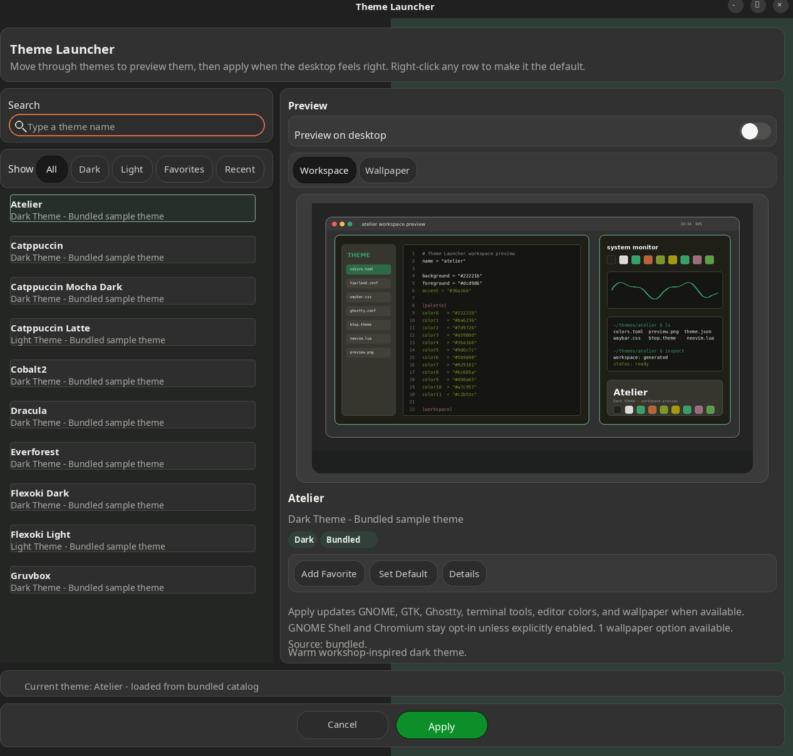

# Theme Launcher

Theme Launcher is a local Ubuntu theme switcher for applying a shared theme catalog across GNOME and selected desktop apps.

It ships with 25 pre-configured themes, each with a palette, workspace preview, and generated wallpaper. It is designed for a single workstation workflow: pick a theme, preview it, apply the matching desktop/app colors, and keep enough state to move back to the previous or default theme quickly.



## What It Themes

- GNOME color mode, icons, wallpaper, and Ubuntu Dock when supported by the current GNOME build
- GNOME Shell top bar through the `user-theme` extension
- Ghostty, including launcher-driven reload support
- VSCodium and VS Code-family editors
- Neovim, btop, tmux, lazygit, fastfetch, bat, and fzf
- GTK CSS generated from the selected theme palette
- Chromium policy colors as an explicit opt-in target

## Quick Start

Install the system packages used by the CLI, GTK launcher, metadata tools, and preview generator:

```bash
sudo apt install bash curl fzf jq tar python3 python3-gi gir1.2-gtk-4.0 gir1.2-gdkpixbuf-2.0 python3-pil
```

Download the repo and put the launcher on your `PATH`:

```bash
git clone https://github.com/bdbetner/theme-launcher.git
cd theme-launcher
mkdir -p ~/.local/bin
ln -sfn "$PWD/bin/theme-launcher" ~/.local/bin/theme-launcher
ln -sfn "$PWD/bin/theme-sync" ~/.local/bin/theme-sync
```

Make sure `~/.local/bin` is on your `PATH`, then run:

```bash
theme-launcher doctor
theme-launcher gui
```

If the command is not already on `PATH`, run it from the repository:

```bash
./bin/theme-launcher gui
./bin/theme-launcher doctor
```

Theme Launcher ships with a small base catalog under `catalog/themes`. Add your own compatible themes under `~/.local/share/theme-launcher/themes`, or configure `theme-launcher sync` with a larger catalog archive as described below.

## Commands

```text
theme-launcher choose
theme-launcher gui
theme-launcher apply THEME
theme-launcher list
theme-launcher current
theme-launcher previous
theme-launcher previous apply
theme-launcher doctor
theme-launcher metadata [THEME]
theme-launcher favorite list|add|remove|toggle THEME
theme-launcher default [THEME]
theme-launcher apply-default
theme-launcher generate-previews [--dry-run]
theme-launcher audit-themes
theme-launcher sync
```

Apply commands support:

```text
--only TARGETS
--skip TARGETS
--wallpaper NAME
--random-wallpaper
```

Example:

```bash
theme-launcher apply rose-pine --only gnome,ghostty
theme-launcher apply-default --skip chromium
theme-launcher previous apply
```

## Theme Catalog

Runtime state and synced themes live under:

```text
~/.local/share/theme-launcher
```

The repository includes a base catalog of 25 pre-configured themes in:

```text
catalog/themes
```

Each bundled theme includes a palette, generated workspace preview, and one wallpaper. Local themes in `~/.local/share/theme-launcher/themes` override bundled themes with the same slug.

Theme sources stay separate:

- bundled themes: `catalog/themes` in this repository
- local custom themes: `~/.local/share/theme-launcher/themes`
- synced catalog themes: `~/.local/share/theme-launcher/vendor/catalog/themes`

Applying a theme writes generated state under `~/.local/share/theme-launcher/state`; it does not copy bundled themes into your local custom theme store.

`theme-launcher sync` expects these environment variables when pulling a catalog archive:

```text
THEME_LAUNCHER_SYNC_ARCHIVE_URL
THEME_LAUNCHER_SYNC_ROOT_DIR
THEME_LAUNCHER_SYNC_SOURCE_LABEL
```

Custom local overrides can live in:

```text
~/.local/share/theme-launcher/themes
```

Each theme directory must include a `colors.toml` with at least:

```toml
background = "#1e1e2e"
foreground = "#cdd6f4"
accent = "#89b4fa"
```

Optional theme files include `preview.png`, `gtk.css`, `ghostty.conf`, `btop.theme`, `neovim.lua`, `vscode.json`, `chromium.theme`, `icons.theme`, and a `backgrounds/` directory.

Each theme may also include an optional `theme.json`. When it is missing, the launcher infers:

- display name from the theme slug
- variant from `light.mode`
- preview image from `preview.png`

Supported metadata keys:

- `name`
- `variant`
- `description`
- `preview`
- `badges`
- `tags`

## Create a Theme

Add custom themes under `~/.local/share/theme-launcher/themes`. The folder name is the theme slug used by CLI commands.

```bash
mkdir -p ~/.local/share/theme-launcher/themes/my-theme/backgrounds
cd ~/.local/share/theme-launcher/themes/my-theme
```

Start with a `colors.toml` file:

```toml
background = "#1e1e2e"
foreground = "#cdd6f4"
accent = "#89b4fa"

color0 = "#45475a"
color1 = "#f38ba8"
color2 = "#a6e3a1"
color3 = "#f9e2af"
color4 = "#89b4fa"
color5 = "#cba6f7"
color6 = "#94e2d5"
color7 = "#bac2de"
```

The required keys are `background`, `foreground`, and `accent`. The optional `color0` through `color15` keys are used by generated app configs and previews when available.

Add optional metadata with `theme.json`:

```json
{
  "name": "My Theme",
  "variant": "dark",
  "description": "Cool muted contrast",
  "badges": ["custom"],
  "tags": ["blue", "minimal"]
}
```

`variant` must be either `dark` or `light`. You can also create an empty `light.mode` file to let Theme Launcher infer a light theme when `theme.json` is missing.

Add images if you want them:

```text
preview.png
backgrounds/1-desktop.png
backgrounds/2-alt.jpg
```

`preview.png` should be a `1366x768` workspace preview. You can create or refresh previews from the theme palette:

```bash
theme-launcher generate-previews --dry-run
theme-launcher generate-previews
```

Add app-specific files only when you want to provide a custom config for that app:

```text
ghostty.conf
btop.theme
neovim.lua
vscode.json
chromium.theme
icons.theme
cursor.theme
```

Theme Launcher can generate GTK, GNOME Shell, tmux, lazygit, fastfetch, bat, and fzf config from `colors.toml` during apply, so most simple themes only need palette colors plus optional app-specific overrides.

Useful formats:

- `icons.theme`: the GNOME icon theme name, such as `Yaru-blue-dark`
- `cursor.theme`: the GNOME cursor theme name
- `chromium.theme`: an RGB triplet, such as `30, 30, 46`
- `vscode.json`: a JSON object with a string `name` and optional string `extension`

Check the result:

```bash
theme-launcher metadata my-theme
theme-launcher doctor
theme-launcher gui
theme-launcher apply my-theme --only gtk,ghostty
```

## GUI Behavior

- The GTK launcher shows catalog previews, selected wallpapers, metadata, variant filters, favorites, search, and default-theme actions.
- Multi-wallpaper themes expose a wallpaper picker and randomize action.
- Theme details and recently inspected themes are available from the launcher.
- Optional desktop preview applies themes while browsing and reverts previews when canceled.
- Favorites and the default theme are stored in local state and are also available from the CLI.

## Catalog Maintenance

Uniform workspace previews can be regenerated from each theme palette:

```bash
theme-launcher generate-previews --dry-run
theme-launcher generate-previews
```

The generator stores backups under `~/.local/share/theme-launcher/state/preview-backups`.

Imported themes can be checked for cleanup issues with:

```bash
theme-launcher audit-themes
```

## Safety Notes

Full applies skip GNOME Shell top-bar and Chromium integration unless they are explicitly enabled.

To apply those targets directly:

```bash
theme-launcher apply THEME --only gnome-shell
theme-launcher apply THEME --only chromium
```

Or set:

```text
THEME_LAUNCHER_ENABLE_GNOME_SHELL=1
THEME_LAUNCHER_ENABLE_CHROMIUM=1
```

`theme-launcher doctor` checks dependencies, writable paths, theme asset shape, GTK bindings, stored theme references, and common GNOME/Chromium integration gaps before apply time.

## Repository Layout

- `bin/theme-launcher`: CLI entrypoint
- `bin/theme-launcher-gui`: GTK launcher
- `bin/theme-sync`: catalog sync entrypoint
- `lib/theme-launcher.sh`: shared runtime library

## Development Checks

```bash
bash -n bin/theme-launcher lib/theme-launcher.sh bin/theme-sync
python3 -m py_compile bin/theme-launcher-gui lib/python/*.py tests/*.py
python3 -m unittest discover -s tests -v
```

GTK application tests are opt-in because they need a responsive graphical session:

```bash
THEME_LAUNCHER_RUN_GTK_TESTS=1 python3 -m unittest tests.test_wallpaper_dropdown -v
```

## License

MIT. See [LICENSE](LICENSE).
